# Video-Audio-TTS Synchronizer

Sistema inteligente de sincronización de audio TTS (Text-to-Speech) con video a partir de archivos de subtítulos SRT.

## ⚡ Instalación rápida desde CLI

Sin `git clone`: descargá el lanzador, ejecutalo y este descarga/actualiza el archivo Python y la interfaz `web/`, crea `.venv` local e instala los requisitos. Sin parámetros abre la web; cualquier parámetro se reenvía al programa.

**macOS / Linux:** `curl -fsSLO https://raw.githubusercontent.com/patchamama/Video-Audio-TTS-Synchronizer/main/start_video_tts.sh && chmod +x start_video_tts.sh && ./start_video_tts.sh`

**Windows (PowerShell):** `iwr https://raw.githubusercontent.com/patchamama/Video-Audio-TTS-Synchronizer/main/start_video_tts.bat -OutFile start_video_tts.bat; .\start_video_tts.bat`

Ejemplo CLI: `./start_video_tts.sh --youtube ULKkrkIJ0h8 --lang de` (Windows: `start_video_tts.bat --youtube ULKkrkIJ0h8 --lang de`). `yt-dlp` se instala desde `requirements.txt` en el entorno `.venv` en todas las plataformas, incluida macOS; el programa lo ejecuta con el mismo Python para evitar usar una copia distinta del PATH.

En **Test audio generation endpoint**, las voces instaladas se filtran por el TTS y el idioma elegidos; **Test selected voice** genera una muestra breve reproducible y con reproducción automática; si el TTS no ofrece voces instaladas, prueba su voz predeterminada.

El formulario principal también permite elegir **TTS** y **Installed voice**; ambos se envían como `--tts` y `--voice` para generar el audio desde los subtítulos con el motor elegido. La respuesta de `/run` también incluye el comando generado para auditar los parámetros enviados. La interfaz EN/ES traduce también los parámetros enviados por `/options` y los paneles dinámicos de resultados y visor. Al seleccionar una voz instalada aparece **Test** a su derecha para escuchar una muestra breve.

## 📋 Tabla de Contenidos

- [Descripción](#-descripción)
- [Características](#-características)
- [Requisitos](#-requisitos)
- [Instalación](#-instalación)
- [Uso](#-uso)
- [Algoritmos y Lógica](#-algoritmos-y-lógica)
- [Diagrama de Flujo](#-diagrama-de-flujo)
- [Archivos Generados](#-archivos-generados)
- [Pendientes y Roadmap](#-pendientes-y-roadmap)
- [Solución de Problemas](#-solución-de-problemas)

## 🎯 Descripción

Este proyecto permite convertir archivos de subtítulos (SRT) en audio sincronizado con video, generando automáticamente voces TTS con ajuste inteligente de velocidad. Es especialmente útil para:

- Crear audiolibros visuales desde subtítulos
- Generar contenido accesible para personas con discapacidad visual
- Crear versiones narradas de presentaciones o cursos
- Procesar y sincronizar contenido educativo

## ✨ Características

### Implementadas

- ✅ **Parseo robusto de SRT**: Valida y renumera subtítulos automáticamente
- ✅ **Ajuste inteligente de velocidad**: 180-240 WPM según disponibilidad de tiempo
- ✅ **Freeze frames automáticos**: Congela video cuando el audio es más largo que el subtítulo
- ✅ **Sincronización precisa**: Construye pista de audio master alineada con timestamps
- ✅ **Eliminación de pausas**: Remueve gaps mayores a 15 minutos
- ✅ **Multi-plataforma**: Compatible con macOS (say), Linux (gTTS + espeak-ng) y Windows (edge-tts + SAPI)
- ✅ **Integración con YouTube**: Descarga automática de videos y subtítulos con yt-dlp
- ✅ **Selección de idioma**: Elección interactiva o automática de subtítulos por idioma
- ✅ **Sistema de checkpoint**: Resume procesamiento interrumpido desde donde se quedó
- ✅ **Rate fijo**: Opción para usar velocidad de audio constante
- ✅ **Nombres descriptivos**: Archivos de salida incluyen TTS usado, OS y configuración
- ✅ **Modo test**: Procesar solo N subtítulos para pruebas rápidas
- ✅ **Progreso visual**: Indicadores de progreso cada 10 subtítulos
- ✅ **SRT debug**: Genera archivo con metadatos de TTS para inspección
- ✅ **Reutilización de audio**: Soporte para carpeta de audios pre-generados

### En Desarrollo

- 🔄 Traducción automática de subtítulos
- 🔄 Interfaz web interactiva
- 🔄 Conversión de formatos de salida

## 📦 Requisitos

### Sistema Operativo

**macOS:**
```bash
brew install ffmpeg
pip3 install yt-dlp  # Para integración con YouTube
# El comando 'say' viene incluido en macOS
```

**Linux/Ubuntu:**
```bash
sudo apt-get install ffmpeg python3
sudo apt install python3-gtts python3-pydub espeak-ng  # espeak-ng es fallback offline
pip install yt-dlp  # Para integración con YouTube
```

**Windows:**
```bash
# Instalar Python desde https://www.python.org/downloads/
# Instalar ffmpeg desde https://ffmpeg.org/download.html

# Opción 1: edge-tts (online, alta calidad)
pip install edge-tts

# Opción 2: pyttsx3 (offline, fallback)
pip install pyttsx3

# Para integración con YouTube
pip install yt-dlp

# Nota: El script detecta automáticamente el sistema y usa el motor apropiado
```

### Python

- Python 3.7+
- Dependencias:
  - **Linux**: `python3-gtts`, `python3-pydub` (desde repositorios apt)
  - **Todas las plataformas**: `yt-dlp` (para descargar videos de YouTube)
    ```bash
    pip install yt-dlp
    ```

## 🚀 Instalación

### Opción 1: One-Liner (¡Más rápido!)

**Linux/Ubuntu:**
```bash
wget -q https://raw.githubusercontent.com/patchamama/Video-Audio-TTS-Synchronizer/main/create_video_tts_from_srt.py && chmod +x create_video_tts_from_srt.py && sudo apt-get install -y ffmpeg python3 python3-gtts python3-pydub espeak-ng && pip install yt-dlp && python3 create_video_tts_from_srt.py
```

**macOS:**
```bash
curl -O https://raw.githubusercontent.com/patchamama/Video-Audio-TTS-Synchronizer/main/create_video_tts_from_srt.py && chmod +x create_video_tts_from_srt.py && brew install ffmpeg && pip3 install yt-dlp && python3 create_video_tts_from_srt.py
```

**Windows (PowerShell como administrador):**
```powershell
Invoke-WebRequest -Uri "https://raw.githubusercontent.com/patchamama/Video-Audio-TTS-Synchronizer/main/create_video_tts_from_srt.py" -OutFile "create_video_tts_from_srt.py"; pip install edge-tts pyttsx3 yt-dlp; python create_video_tts_from_srt.py
```
*Nota: Requiere Python y ffmpeg instalados previamente en Windows*

Esto descarga el script, instala dependencias y lo ejecuta en modo interactivo.

### Opción 2: Descarga Directa Paso a Paso

```bash
# Descargar el script Python
wget https://raw.githubusercontent.com/patchamama/Video-Audio-TTS-Synchronizer/main/create_video_tts_from_srt.py

# Instalar dependencias (Linux/Ubuntu)
sudo apt-get install ffmpeg python3 python3-gtts python3-pydub espeak-ng
pip install yt-dlp

# Dar permisos de ejecución
chmod +x create_video_tts_from_srt.py

# Ejecutar (modo interactivo si no se dan parámetros)
python3 create_video_tts_from_srt.py

# O ejecutar con parámetros directamente
python3 create_video_tts_from_srt.py mi_video.srt mi_video.mp4
```

Para generar solo el audio podés omitir el video:

```bash
python3 create_video_tts_from_srt.py mi_video.srt
```

Es equivalente a `python3 create_video_tts_from_srt.py mi_video.srt mi_video.mp4 --solo-audio --no-truncate`; usa `mi_video.mp4` solo como base para nombrar los audios de salida, por lo que no necesita existir.

### Opción 3: Clonar Repositorio Completo

```bash
# Clonar el repositorio
git clone https://github.com/patchamama/Video-Audio-TTS-Synchronizer.git
cd Video-Audio-TTS-Synchronizer

# Instalar dependencias (Linux)
sudo apt install python3-gtts python3-pydub espeak-ng
pip install yt-dlp

# Verificar ffmpeg
ffmpeg -version

# Dar permisos de ejecución
chmod +x create_video_tts_from_srt.py
```

## 🌍 Soporte Multi-Plataforma con Fallback Automático

El script detecta automáticamente tu sistema operativo y selecciona el motor TTS más apropiado con fallback inteligente:

### macOS
```
└─ comando 'say' (nativo)
   └─ Voz: Paulina (español)
```

### Linux
```
┌─ gTTS (Google TTS) - online, alta calidad
│  ├─ 3 reintentos automáticos con backoff exponencial
│  └─ Requiere internet
└─ espeak-ng - offline, fallback confiable
   └─ Voz sintética pero siempre disponible
```

### Windows
```
┌─ edge-tts (Microsoft Edge TTS) - online, alta calidad
│  ├─ Voz neural: es-ES-ElviraNeural
│  └─ Requiere internet
└─ SAPI/pyttsx3 - offline, fallback nativo
   └─ Usa voces instaladas en Windows
```

**Ventajas del sistema de fallback:**
- ✅ No requiere configuración manual
- ✅ Prioriza calidad cuando hay internet
- ✅ Garantiza funcionamiento offline
- ✅ Manejo automático de errores de conexión

## 💻 Uso

### Modo Interactivo (Recomendado para principiantes)

Si ejecutas el script sin parámetros, inicia el modo interactivo:

```bash
python3 create_video_tts_from_srt.py
```

El script te guiará paso a paso preguntando:
- 📄 Archivo de subtítulos (SRT)
- 🎥 Archivo de video
- 🧪 ¿Activar modo test?
- 🎵 ¿Solo generar audio?
- ⏩ ¿Truncar audios largos o usar freeze?
- ✂️ ¿Eliminar pausas largas?

### Sintaxis Básica (Modo Comando)

```bash
python3 create_video_tts_from_srt.py <archivo.srt> [video.mp4] [opciones]
```

### Parámetros

#### Posicionales

| Parámetro | Descripción | Requerido |
|-----------|-------------|-----------|
| `srt_file` | Archivo de subtítulos SRT | ✅ Sí |
| `video` | Archivo de video (mp4, mkv, etc.). Si se omite, usa el `.mp4` homónimo como base y activa `--solo-audio --no-truncate`; en ese modo el archivo no necesita existir. | ❌ No |
| `audio_dir` | Carpeta con audios ya generados | ❌ No |

#### Opcionales

| Opción | Descripción | Default |
|--------|-------------|---------|
| `--test N` | Procesar solo N subtítulos | - |
| `--solo-audio` | Solo generar audio, sin video | False |
| `--no-freeze` | Truncar en lugar de freeze | False |
| `--no-truncate` | Nunca trunca texto: conserva el audio largo y usa 240 WPM en los siguientes segmentos hasta recuperar el desfase. Genera `<srt>-to-test.srt` ajustado al audio y, si hace falta, prolonga el último frame del video. | False |
| `--remove-breaks` | Eliminar pausas >15min | False |
| `--only-remove-breaks` | Solo eliminar pausas (sin TTS) | False |
| `--youtube ID/URL` | Descargar video y subtítulos de YouTube | - |
| `--lang CÓDIGO` | Idioma de subtítulos para TTS (es, en, de, fr, it, pt, ja, zh) | es |
| `--fix-rate RATE` | Usar rate de audio fijo (ej: 180, 200) | 180 |
| `--continue CARPETA` | Reanudar desde checkpoint | - |

### Ejemplos

#### Caso 1: Proceso completo

```bash
# Genera video completo con audio TTS sincronizado
python3 create_video_tts_from_srt.py mi_video.srt mi_video.mp4
```

**Resultado:** `mi_video_con_tts.mkv`

#### Caso 2: Modo test

```bash
# Procesa solo los primeros 50 subtítulos
python3 create_video_tts_from_srt.py mi_video.srt mi_video.mp4 --test 50
```

**Uso:** Ideal para probar configuración sin procesar todo el video.

#### Caso 3: Solo audio

```bash
# Genera únicamente el audio master sin procesar video
python3 create_video_tts_from_srt.py mi_video.srt mi_video.mp4 --solo-audio
```

**Resultado:** `temp_audio_*/audio_final.wav`

#### Caso 4: No-truncate — conservar todo el texto

```bash
# Si un audio excede su ventana, se conserva completo a 240 WPM.
# Los siguientes segmentos se generan a 240 WPM hasta recuperar el desfase.
python3 create_video_tts_from_srt.py mi_video.srt mi_video.mp4 --no-truncate
```

```bash
python3 create_video_tts_from_srt.py mi_video.srt --fix-rate-not-truncate 200
```

`--fix-rate-not-truncate [ppm]` crea solo audio continuo con rate constante (200 ppm por defecto) y un `<srt>-fixed-rate-<ppm>.srt` nuevo. Ignora los tiempos y huecos del SRT original: conserva únicamente el texto y sus pausas naturales de puntuación.

`--optimize-rate` es opcional: evalúa las primeras 50 entradas y luego reutiliza el rate más efectivo. Sin esa bandera, el procesamiento usa el rate base sin aprendizaje automático.

> Si ejecutás solo `create_video_tts_from_srt.py` y el repositorio es privado, la interfaz avanzada descarga `web/` usando `GITHUB_TOKEN`. En PowerShell: `$env:GITHUB_TOKEN = "github_pat_..."`; en CMD: `set GITHUB_TOKEN=github_pat_...`. Sin token, se muestra la interfaz mínima.

**Uso:** Priorizá esta opción cuando ningún fragmento de texto puede perderse. Puede desfasar temporalmente el audio y extender el último frame del video.

Además genera `mi_video-to-test.srt`: cada cue usa el inicio y fin reales del audio, y su texto comienza con el desfase frente al SRT original, por ejemplo `(1.250s) Texto del subtítulo`.

#### Caso 5: Sin freeze frames

```bash
# Trunca audios largos en lugar de congelar video
python3 create_video_tts_from_srt.py mi_video.srt mi_video.mp4 --no-freeze
```

**Uso:** Cuando prefieres mantener el ritmo del video original.

#### Caso 6: Eliminar pausas

```bash
# Procesa y elimina pausas mayores a 15 minutos
python3 create_video_tts_from_srt.py mi_video.srt mi_video.mp4 --remove-breaks
```

**Resultado:** `mi_video_sin_pausas.mkv`

#### Caso 7: Multi-idioma TTS

```bash
# Genera audio en inglés
python3 create_video_tts_from_srt.py mi_video_en.srt mi_video.mp4 --lang en

# Genera audio en alemán
python3 create_video_tts_from_srt.py mi_video_de.srt mi_video.mp4 --lang de

# Genera audio en francés
python3 create_video_tts_from_srt.py mi_video_fr.srt mi_video.mp4 --lang fr
```

**Uso:** El script selecciona automáticamente las voces TTS apropiadas para el idioma especificado en cada sistema operativo (macOS: Samantha para inglés, Anna para alemán; Windows: en-US-JennyNeural, de-DE-KatjaNeural; Linux: voces de gTTS/espeak-ng correspondientes).

**Idiomas soportados:** es (español), en (inglés), de (alemán), fr (francés), it (italiano), pt (portugués), ja (japonés), zh (chino)

#### Caso 7: Reutilizar audios

```bash
# Usa audios previamente generados
python3 create_video_tts_from_srt.py mi_video.srt mi_video.mp4 ./temp_audio_xyz/
```

**Uso:** Evita regenerar audios si ya los tienes.

#### Caso 8: Descargar de YouTube (Modo Automático)

```bash
# Descarga video y subtítulos automáticamente
python3 create_video_tts_from_srt.py --youtube dQw4w9WgXcQ

# O usa URL completa
python3 create_video_tts_from_srt.py --youtube "https://www.youtube.com/watch?v=dQw4w9WgXcQ"

# Con idioma específico
python3 create_video_tts_from_srt.py --youtube dQw4w9WgXcQ --lang es
```

**Resultado:** Descarga video, lista subtítulos disponibles, permite selección interactiva (o automática con --lang), y procesa todo.

#### Caso 9: Rate fijo para velocidad constante

```bash
# Usa siempre 200 WPM (no prueba otros rates)
python3 create_video_tts_from_srt.py mi_video.srt mi_video.mp4 --fix-rate 200

# O usa rate por defecto (180 WPM)
python3 create_video_tts_from_srt.py mi_video.srt mi_video.mp4 --fix-rate
```

**Uso:** Útil cuando quieres velocidad constante sin optimización automática.

#### Caso 10: Reanudar procesamiento interrumpido

```bash
# Primera ejecución (se interrumpe en subtítulo 450)
python3 create_video_tts_from_srt.py mi_video.srt mi_video.mp4
# Ctrl+C o error...

# Reanudar desde donde se quedó
python3 create_video_tts_from_srt.py --continue temp_mi_video_abc123
```

**Resultado:** Continúa desde el último checkpoint guardado, salta subtítulos ya procesados.

#### Caso 11: YouTube + Rate fijo + Test

```bash
# Descarga de YouTube, usa rate 220 constante, procesa solo 30 subtítulos
python3 create_video_tts_from_srt.py --youtube dQw4w9WgXcQ --lang en --fix-rate 220 --test 30
```

**Uso:** Combina múltiples opciones para pruebas rápidas.

## 📁 Estructura del Proyecto

```
Video-Audio-TTS-Synchronizer/
├── create_video_tts_from_srt.py    # Script principal
├── README.md                        # Documentación
├── tests/                           # Scripts de testing
│   ├── test_checkpoint_system.py
│   ├── test_colors_platform.py
│   ├── test_multiplatform_tts.py
│   ├── linux/                       # Tests específicos Linux
│   │   ├── test_gtts.py
│   │   ├── test_tts_fallback.py
│   │   └── ...
│   └── windows/                     # Tests específicos Windows
│       ├── test_windows_tts.py
│       └── test_windows_tts.ps1
└── examples/                        # Ejemplos de uso
    ├── linux/
    │   └── example_espeak_simple.py
    └── windows/
        ├── WINDOWS_TTS_GUIDE.md
        └── windows_tts_oneliner.txt
```

## 🧠 Algoritmos y Lógica

### 1. Validación y Parseo de SRT

**Objetivo:** Extraer y validar subtítulos con timestamps correctos.

**Proceso:**
1. Lee archivo SRT línea por línea
2. Detecta bloques: ID → Timestamps → Texto
3. Valida formato de timestamps (HH:MM:SS,mmm)
4. Verifica duración positiva (end > start)
5. Asigna IDs consecutivos (1, 2, 3...) preservando el ID original
6. Muestra progreso cada 100 subtítulos (puntos en pantalla)

**Manejo de errores:**
- Timestamps negativos: Muestra error detallado y continúa
- Formatos inválidos: Salta el subtítulo y reporta
- IDs duplicados: Renumera automáticamente

### 2. Generación TTS con Ajuste Inteligente

**Objetivo:** Generar audio que se ajuste al tiempo disponible.

**Algoritmo de velocidad adaptativa:**

```
Para cada subtítulo:
  1. Calcular tiempo disponible:
     - Si hay siguiente: tiempo_disponible = start_next - start_current
     - Si es el último: tiempo_disponible = duration

  2. Fase de aprendizaje (primeros 10 subtítulos):
     - Probar rates: 180, 200, 220, 240 WPM
     - Elegir el rate más rápido que cabe
     - Si ninguno cabe: marcar para freeze frame

  3. Fase de optimización (después de 10 subtítulos):
     - Usar el rate más exitoso de la fase de aprendizaje
     - Si no cabe: probar rates más lentos
     - Si aún no cabe: freeze frame o truncar

  4. Generar audio con el rate seleccionado

  5. Actualizar estadísticas de uso de rates
```

**Rates disponibles:**
- 180 WPM: Velocidad lenta, clara
- 200 WPM: Velocidad normal
- 220 WPM: Velocidad rápida
- 240 WPM: Velocidad muy rápida

**Estrategias cuando el audio es muy largo:**

- **Freeze Frame** (default): Congela el último frame del video durante el exceso
- **Truncate** (`--no-freeze`): Corta el audio al tiempo disponible

### 3. Construcción del Audio Master

**Objetivo:** Crear pista de audio sincronizada con los timestamps del SRT.

**Algoritmo:**

```
audio_master = silencio(0.001s)
current_time = 0.0

Para cada subtítulo:
  1. Calcular gap = subtitle.start_seconds - current_time

  2. Si gap > 0:
     - Agregar silencio de duración 'gap'

  3. Concatenar audio del subtítulo:
     ffmpeg -i audio_master -i subtitle_audio
            -filter_complex concat
            -o nuevo_master

  4. Actualizar current_time:
     - Si hay freeze: += subtitle.duration + freeze_duration
     - Si no hay freeze: += subtitle.duration

  5. audio_master = nuevo_master
```

**Optimización de nombres:** Usa contador incremental para evitar conflictos de archivos temporales.

### 4. Procesamiento de Video con Freeze Frames

**Objetivo:** Extender video cuando el audio TTS es más largo que el subtítulo.

**Algoritmo:**

```
Para cada subtítulo con freeze:
  1. Calcular frame de inicio y fin del subtítulo

  2. Extraer segmento de video hasta el último frame

  3. Generar freeze:
     - Extraer último frame como imagen
     - Crear video estático de duración = freeze_duration
     - Mantener FPS del video original

  4. Concatenar: video_segment + freeze_video

  5. Actualizar offset de tiempo para siguientes segmentos
```

**Cálculos:**
```python
start_frame = int(subtitle.start_seconds * fps)
end_frame = int(subtitle.end_seconds * fps)
freeze_frames = int(freeze_duration * fps)
```

### 5. Eliminación de Pausas Largas

**Objetivo:** Remover gaps mayores a 15 minutos del video final.

**Algoritmo:**

```
segments = []
current_start = 0.0

Para cada par de subtítulos consecutivos:
  1. Calcular gap = next.start_seconds - current.end_seconds

  2. Si gap >= 900s (15 minutos):
     - Agregar segmento: [current_start, current.end_seconds]
     - current_start = next.start_seconds

  3. Si es el último subtítulo:
     - Agregar segmento final

Luego:
  Para cada segmento:
    1. Extraer con ffmpeg
    2. Generar archivo de lista para concatenación

  3. Concatenar todos los segmentos
```

## 📊 Diagrama de Flujo

```mermaid
flowchart TD
    Start([Inicio]) --> CheckTTS[Detectar método TTS<br/>macOS: say<br/>Linux: gTTS]
    CheckTTS --> ValidateFiles{¿Archivos<br/>existen?}
    ValidateFiles -->|No| Error1([Error: Archivos no encontrados])
    ValidateFiles -->|Sí| ParseSRT[PASO 1: Parsear y validar SRT]

    ParseSRT --> ValidateTimestamps{¿Timestamps<br/>válidos?}
    ValidateTimestamps -->|No| Error2([Error: Timestamps inválidos])
    ValidateTimestamps -->|Sí| RenumberIDs[Renumerar IDs: 1, 2, 3...]

    RenumberIDs --> TestMode{¿Modo<br/>test?}
    TestMode -->|Sí| LimitSubs[Limitar a N subtítulos]
    TestMode -->|No| GenerateWorking[Generar working.srt]
    LimitSubs --> GenerateWorking

    GenerateWorking --> CheckOnlyBreaks{¿Solo eliminar<br/>pausas?}
    CheckOnlyBreaks -->|Sí| Step7
    CheckOnlyBreaks -->|No| Step2

    Step2[PASO 2: Generar audios TTS] --> LearningPhase{¿Primeros 10<br/>subtítulos?}

    LearningPhase -->|Sí| TryRates[Probar rates: 180, 200, 220, 240 WPM]
    LearningPhase -->|No| UseOptimal[Usar rate óptimo aprendido]

    TryRates --> SelectBest[Seleccionar rate más rápido que cabe]
    SelectBest --> CheckFits{¿Audio<br/>cabe?}
    UseOptimal --> CheckFits

    CheckFits -->|No| CheckNoFreeze{¿No-freeze<br/>activo?}
    CheckFits -->|Sí| GenerateTTS[Generar audio TTS]

    CheckNoFreeze -->|Sí| TruncateAudio[Truncar audio]
    CheckNoFreeze -->|No| MarkFreeze[Marcar para freeze frame]

    TruncateAudio --> GenerateTTS
    MarkFreeze --> GenerateTTS

    GenerateTTS --> UpdateStats[Actualizar estadísticas de rates]
    UpdateStats --> MoreSubs{¿Más<br/>subtítulos?}
    MoreSubs -->|Sí| Step2
    MoreSubs -->|No| ShowStats[Mostrar estadísticas finales]

    ShowStats --> Step3[PASO 3: Generar debug.srt<br/>con metadatos de TTS]

    Step3 --> CheckSoloAudio{¿Solo<br/>audio?}
    CheckSoloAudio -->|Sí| Step5
    CheckSoloAudio -->|No| Step4

    Step4[PASO 4: Procesar video] --> CheckFreeze{¿Hay freeze<br/>frames?}
    CheckFreeze -->|No| UseOriginal[Usar video original]
    CheckFreeze -->|Sí| ProcessVideo[Procesar video con freezes]

    ProcessVideo --> GetFPS[Obtener FPS del video]
    GetFPS --> LoopSegments[Para cada subtítulo con freeze]

    LoopSegments --> ExtractSegment[Extraer segmento de video]
    ExtractSegment --> ExtractFrame[Extraer último frame como imagen]
    ExtractFrame --> CreateFreeze[Crear video estático<br/>duración = freeze_duration]
    CreateFreeze --> ConcatFreeze[Concatenar segmento + freeze]
    ConcatFreeze --> MoreSegments{¿Más<br/>segmentos?}
    MoreSegments -->|Sí| LoopSegments
    MoreSegments -->|No| FinalConcat[Concatenar todos los segmentos]

    FinalConcat --> Step5
    UseOriginal --> Step5

    Step5[PASO 5: Sincronizar audio master] --> InitAudio[Crear audio inicial: silencio 0.001s]
    InitAudio --> LoopSync[Para cada subtítulo]

    LoopSync --> CalcGap[Calcular gap = start - current_time]
    CalcGap --> CheckGap{¿Gap > 0?}
    CheckGap -->|Sí| AddSilence[Agregar silencio]
    CheckGap -->|No| ConcatAudio[Concatenar audio TTS]
    AddSilence --> ConcatAudio

    ConcatAudio --> UpdateTime[Actualizar current_time]
    UpdateTime --> MoreSync{¿Más<br/>subtítulos?}
    MoreSync -->|Sí| LoopSync
    MoreSync -->|No| FinalAudio[Audio master completo]

    FinalAudio --> CheckVideoSkip{¿Solo<br/>audio?}
    CheckVideoSkip -->|Sí| Cleanup
    CheckVideoSkip -->|No| Step6

    Step6[PASO 6: Fusionar video y audio] --> ReencodeVideo[Re-codificar video<br/>libx264 -preset ultrafast]
    ReencodeVideo --> MergeAudio[Fusionar con audio master<br/>codec AAC 192k]
    MergeAudio --> CheckMerge{¿Merge<br/>exitoso?}
    CheckMerge -->|No| Error3([Error: No se pudo fusionar])
    CheckMerge -->|Sí| OutputTTS[Video con TTS generado]

    OutputTTS --> Step7{¿Eliminar<br/>pausas?}
    Step7 -->|No| Cleanup
    Step7 -->|Sí| FindGaps[PASO 7: Buscar gaps >= 15 min]

    FindGaps --> CheckGaps{¿Hay<br/>gaps?}
    CheckGaps -->|No| NoBreaks[No hay pausas a eliminar]
    CheckGaps -->|Sí| CreateSegments[Crear segmentos sin pausas]

    NoBreaks --> Cleanup
    CreateSegments --> ExtractSegs[Extraer cada segmento con ffmpeg]
    ExtractSegs --> ConcatSegs[Concatenar segmentos]
    ConcatSegs --> OutputClean[Video sin pausas generado]

    OutputClean --> Cleanup[Limpiar archivos temporales]
    Cleanup --> End([Fin])

    style Start fill:#90EE90
    style End fill:#90EE90
    style Error1 fill:#FFB6C6
    style Error2 fill:#FFB6C6
    style Error3 fill:#FFB6C6
    style Step2 fill:#87CEEB
    style Step3 fill:#87CEEB
    style Step4 fill:#87CEEB
    style Step5 fill:#87CEEB
    style Step6 fill:#87CEEB
    style Step7 fill:#87CEEB
```



## 📁 Archivos Generados

### Durante el Proceso

| Archivo | Descripción | Ubicación |
|---------|-------------|-----------|
| `{video}_working.srt` | Subtítulos con IDs renumerados 1-N | Directorio de trabajo |
| `{video}_debug.srt` | Subtítulos con metadatos TTS (rate, offsets, flags) | Directorio de trabajo |
| `temp_{srt-name}_{code}/` | Carpeta temporal con checkpoints y audios | Directorio actual de trabajo |
| `temp_{srt-name}_{code}/checkpoint.json` | Estado del procesamiento (para resume) | Dentro de temp |
| `youtube_{video_id}/` | Carpeta con video y subtítulos de YouTube | Directorio actual (si se usa --youtube) |

### Salida Final

El formato de nombres incluye información completa del procesamiento:

**Formato:** `{video}_{tts}_{os}_{freeze}.mkv`

| Archivo | Ejemplo | Descripción |
|---------|---------|-------------|
| Video principal | `video_gtts_Linux_freeze.mkv` | TTS usado, OS, y estado de freeze |
| Sin pausas | `video_gtts_Linux_freeze_sin_pausas.mkv` | Con `--remove-breaks` |
| Solo audio WAV | `video_tts_audio.wav` | Con `--solo-audio` |
| Solo audio AAC | `video_tts_audio.aac` | Con `--solo-audio` |
| Solo audio MP3 | `video_tts_audio.mp3` | Con `--solo-audio` |

**Componentes del nombre:**
- `{tts}`: Motor usado (say, gtts, espeak-ng, edge-tts, sapi)
- `{os}`: Sistema operativo (macOS, Linux, Windows)
- `{freeze}`: Estado de freeze (freeze / nofreeze)

**Ejemplos reales:**
```
video_say_macOS_nofreeze.mkv              # macOS, sin freeze necesario
video_gtts_Linux_freeze.mkv               # Linux, con freeze frames
video_espeak-ng_Linux_nofreeze.mkv        # Linux, fallback espeak-ng
video_edge-tts_Windows_freeze.mkv         # Windows, online TTS
video_sapi_Windows_nofreeze_sin_pausas.mkv  # Windows, offline, sin pausas
```

### Ejemplo de debug.srt

```srt
1
00:00:00,000 --> 00:00:03,500
[#1 r200] Bienvenidos al curso de programación

2
00:00:03,500 --> 00:00:07,800
[#2 r220 +150ms] En esta lección aprenderemos Python

3
00:00:07,800 --> 00:00:12,500
[#3 r240] [🎬 FREEZE 1.2s] Python es un lenguaje muy popular

4
00:00:12,500 --> 00:00:15,000
[#4 r180] [✂️ TRUNCADO] Este texto fue demasiado largo...
```

**Metadatos:**
- `#N`: ID consecutivo
- `rXXX`: Rate en WPM (180, 200, 220, 240)
- `+XXXms`: Offset acumulado por freeze frames anteriores
- `🎬 FREEZE Xs`: Video congelado X segundos
- `✂️ TRUNCADO`: Audio cortado (modo `--no-freeze`)

## 🚧 Pendientes y Roadmap

### 🔴 Alta Prioridad

#### Testing Automatizado

**Estado:** 📝 Por implementar

**Descripción:**
Suite completa de tests unitarios y de integración usando `pytest`.

**Tareas:**
- [ ] Tests de parseo de SRT (válidos, inválidos, edge cases)
- [ ] Tests de conversión de timestamps
- [ ] Tests de algoritmo de selección de rate
- [ ] Tests de generación de TTS (mock)
- [ ] Tests de concatenación de audio
- [ ] Tests de procesamiento de video
- [ ] Tests de eliminación de pausas
- [ ] Tests de integración end-to-end
- [ ] CI/CD con GitHub Actions

**Archivos a crear:**
```
tests/
├── test_srt_parser.py
├── test_tts_engine.py
├── test_audio_sync.py
├── test_video_processor.py
├── test_integration.py
├── fixtures/
│   ├── sample.srt
│   ├── sample_invalid.srt
│   └── sample_video.mp4
└── conftest.py
```

#### Interfaz Interactiva para Parámetros

**Estado:** 📝 Por implementar

**Descripción:**
Prompt interactivo que guía al usuario en la configuración.

**Funcionalidad:**
```bash
$ python3 create_video_tts_from_srt.py --interactive

🎬 Video-Audio-TTS Synchronizer - Modo Interactivo
===================================================

📄 Archivo SRT: |> video.srt
🎥 Archivo de video: |> video.mp4

🔧 Configuración:
━━━━━━━━━━━━━━━━━━━━━━━━━━━━━━━━━━━━━━━━━━━━━━━━

  ¿Modo test? (s/N): s
  → ¿Cuántos subtítulos? (default: 30): 50

  ¿Solo generar audio? (s/N): n

  ¿Cómo manejar audios largos?
    1) Freeze frame (default)
    2) Truncar audio
  → Opción (1): 1

  ¿Eliminar pausas largas? (s/N): s

✅ Configuración completa. ¿Continuar? (S/n): s

Procesando...
```

**Tareas:**
- [ ] Implementar clase `InteractivePrompt`
- [ ] Validación de inputs en tiempo real
- [ ] Confirmación de configuración antes de procesar
- [ ] Guardar configuración como preset (JSON/YAML)
- [ ] Cargar presets guardados

### 🟡 Media Prioridad

#### Descarga Directa de Videos de YouTube

**Estado:** 📝 Por implementar

**Descripción:**
Integración con `yt-dlp` para descargar videos con subtítulos directamente.

**Funcionalidad:**
```bash
# Descargar video con subtítulos
python3 create_video_tts_from_srt.py --youtube URL

# Descargar y procesar directamente
python3 create_video_tts_from_srt.py --youtube URL --auto-process

# Seleccionar idioma de subtítulos
python3 create_video_tts_from_srt.py --youtube URL --lang es
```

**Tareas:**
- [ ] Instalar dependencia: `pip install yt-dlp`
- [ ] Implementar clase `YouTubeDownloader`
- [ ] Descargar video en mejor calidad disponible
- [ ] Extraer/descargar subtítulos disponibles
- [ ] Soporte para subtítulos automáticos
- [ ] Soporte para múltiples idiomas
- [ ] Limpieza de subtítulos automáticos (ruido, duplicados)
- [ ] Integración con flujo principal

**Implementación:**
```python
class YouTubeDownloader:
    def download(self, url: str, output_dir: Path) -> Tuple[Path, Path]:
        """
        Descarga video y subtítulos
        Returns: (video_path, srt_path)
        """
        # Usar yt-dlp con opciones optimizadas
        pass

    def list_subtitles(self, url: str) -> List[str]:
        """Lista idiomas de subtítulos disponibles"""
        pass
```

#### Sistema de Múltiples Voces

**Estado:** 📝 Por implementar

**Descripción:**
Soporte para asignar diferentes voces a diferentes hablantes.

**Casos de uso:**
- Diálogos con personajes
- Entrevistas
- Narrador + personajes

**Formato SRT extendido:**
```srt
1
00:00:00,000 --> 00:00:03,500
[NARRADOR] Bienvenidos al programa

2
00:00:03,500 --> 00:00:06,000
[JUAN] Hola, mucho gusto

3
00:00:06,000 --> 00:00:08,500
[MARÍA] Encantada de conocerte
```

**Configuración de voces:**
```yaml
# voices.yaml
voices:
  NARRADOR:
    system: macos
    voice: "Jorge"
    rate_base: 200

  JUAN:
    system: macos
    voice: "Diego"
    rate_base: 180

  MARÍA:
    system: macos
    voice: "Paulina"
    rate_base: 190

  default:
    system: macos
    voice: "Paulina"
    rate_base: 200
```

**Tareas:**
- [ ] Parsear etiquetas de hablante en SRT
- [ ] Cargar configuración de voces (YAML/JSON)
- [ ] Extender `TTSEngine` para múltiples voces
- [ ] Mapeo automático de hablantes a voces disponibles
- [ ] Soporte para voces de gTTS (múltiples idiomas)
- [ ] UI para asignar voces interactivamente

#### Autogeneración de Subtítulos con Whisper

**Estado:** 📝 Por implementar

**Descripción:**
Integración con OpenAI Whisper para transcribir audio a subtítulos.

**Funcionalidad:**
```bash
# Extraer subtítulos de un video
python3 create_video_tts_from_srt.py --extract-subs video.mp4

# Extraer en idioma específico
python3 create_video_tts_from_srt.py --extract-subs video.mp4 --lang es

# Extraer y procesar directamente
python3 create_video_tts_from_srt.py --extract-subs video.mp4 --auto-process
```

**Tareas:**
- [ ] Instalar: `pip install openai-whisper`
- [ ] Implementar clase `WhisperTranscriber`
- [ ] Extraer audio del video con ffmpeg
- [ ] Transcribir con Whisper (modelo configurable)
- [ ] Generar archivo SRT desde transcripción
- [ ] Soporte para múltiples idiomas
- [ ] Opción de traducción automática
- [ ] Post-procesamiento: puntuación, capitalización
- [ ] Detección de hablantes (diarization)

**Modelos Whisper:**
- `tiny`: Rápido, menos preciso
- `base`: Balance
- `small`: Buena precisión
- `medium`: Alta precisión
- `large`: Máxima precisión (lento)

#### Traducción y Multi-idioma

**Estado:** 📝 Por implementar

**Descripción:**
Generar versiones del video en múltiples idiomas automáticamente.

**Funcionalidad:**
```bash
# Traducir subtítulos y generar TTS
python3 create_video_tts_from_srt.py video.srt video.mp4 \
  --translate en,fr,de

# Especificar idioma origen
python3 create_video_tts_from_srt.py video.srt video.mp4 \
  --translate-from es --translate-to en,fr,de,pt
```

**Salida:**
```
video_con_tts_es.mkv  (español - original)
video_con_tts_en.mkv  (inglés)
video_con_tts_fr.mkv  (francés)
video_con_tts_de.mkv  (alemán)
```

**Tareas:**
- [ ] Integrar API de traducción (Google Translate, DeepL, etc.)
- [ ] Implementar clase `SubtitleTranslator`
- [ ] Traducir subtítulos manteniendo formato
- [ ] Ajustar timing si el texto traducido es más largo
- [ ] Generar TTS en idioma destino (gTTS multilenguaje)
- [ ] Mapeo de voces por idioma
- [ ] Procesamiento en paralelo de múltiples idiomas
- [ ] Verificación de calidad de traducción

**Configuración:**
```yaml
# translation.yaml
translation:
  provider: "deepl"  # google, deepl, openai
  api_key: "xxx"

  voices_per_language:
    es: "Paulina"
    en: "Samantha"
    fr: "Amelie"
    de: "Anna"
    pt: "Luciana"
```

### 🟢 Baja Prioridad

#### Conversión de Formatos de Salida

**Estado:** 📝 Por implementar

**Descripción:**
Convertir el video final a diferentes formatos y resoluciones.

**Funcionalidad:**
```bash
# Especificar formato de salida
python3 create_video_tts_from_srt.py video.srt video.mp4 \
  --output-format mp4

# Especificar codec
python3 create_video_tts_from_srt.py video.srt video.mp4 \
  --video-codec h265 --audio-codec opus

# Presets de calidad
python3 create_video_tts_from_srt.py video.srt video.mp4 \
  --preset web    # 720p, H264, AAC
  --preset hd     # 1080p, H264, AAC
  --preset 4k     # 4K, H265, AAC
  --preset stream # Optimizado para streaming
```

**Tareas:**
- [ ] Implementar clase `VideoConverter`
- [ ] Soporte para formatos: MP4, MKV, WebM, AVI
- [ ] Soporte para codecs: H264, H265, VP9, AV1
- [ ] Presets de calidad
- [ ] Redimensionar video (1080p, 720p, 480p)
- [ ] Ajuste de bitrate
- [ ] Optimización para plataformas (YouTube, Vimeo, etc.)

#### Preparación para Whisper

**Estado:** 📝 Por implementar

**Descripción:**
Preparar video para procesamiento óptimo con Whisper.

**Funcionalidad:**
```bash
# Preparar video para Whisper
python3 create_video_tts_from_srt.py --prepare-whisper video.mp4

# Salida: video_whisper_ready.mp4 + audio_16k.wav
```

**Optimizaciones:**
- Extraer audio en formato óptimo (WAV, 16kHz, mono)
- Reducción de ruido
- Normalización de audio
- Detección de silencios para segmentación
- Separación de voces (si hay música de fondo)

**Tareas:**
- [ ] Implementar clase `WhisperPreprocessor`
- [ ] Extraer audio en formato óptimo
- [ ] Reducción de ruido con `noisereduce`
- [ ] Normalización con `pydub`
- [ ] Detección de actividad de voz (VAD)
- [ ] Segmentación inteligente en chunks
- [ ] Separación de fuentes con `spleeter` (opcional)

#### Sistema de Plugins

**Estado:** 📝 Por implementar

**Descripción:**
Arquitectura de plugins para extender funcionalidad.

**Ejemplo de plugin:**
```python
# plugins/custom_voice.py
from tts_synchronizer import Plugin, TTSEngine

class CustomVoicePlugin(Plugin):
    name = "custom_voice"
    version = "1.0.0"

    def process_audio(self, text: str, rate: int) -> Path:
        # Lógica personalizada
        pass

    def register(self, engine: TTSEngine):
        engine.register_voice_provider(self)
```

**Tareas:**
- [ ] Diseñar API de plugins
- [ ] Sistema de descubrimiento de plugins
- [ ] Hooks en puntos clave del proceso
- [ ] Documentación para desarrollo de plugins
- [ ] Repositorio de plugins comunitarios

#### Interfaz Gráfica (GUI)

**Estado:** 💭 Idea

**Descripción:**
GUI con PyQt6 o Tkinter para uso más intuitivo.

**Características:**
- Drag & drop de archivos
- Vista previa de subtítulos
- Editor de timing
- Configuración visual de voces
- Barra de progreso en tiempo real
- Vista previa del resultado

#### Procesamiento en la Nube

**Estado:** 💭 Idea

**Descripción:**
API REST para procesar videos en servidores remotos.

**Casos de uso:**
- Videos muy largos
- Procesamiento masivo
- Hardware limitado localmente

**Stack sugerido:**
- FastAPI para la API
- Celery para workers
- Redis para cola de tareas
- S3 para almacenamiento

## 🔧 Solución de Problemas

### Test de Diagnóstico gTTS

Si encuentras errores de conexión con gTTS ("Failed to connect"), usa el script de diagnóstico:

```bash
python3 test_gtts.py
```

**¿Qué hace?**
- Verifica la conexión a Google TTS
- Genera audio de prueba en español
- Convierte MP3 a WAV
- Valida la calidad del audio generado

**Resultados posibles:**

✅ **Test exitoso**: gTTS funciona correctamente. Si el script principal falla, revisa los parámetros.

❌ **Error de conexión**: Indica problemas de red. Posibles causas:
- Sin conexión a internet
- Firewall bloqueando acceso a Google TTS
- Proxy o VPN interfiriendo
- Google TTS temporalmente no disponible

**Solución:**
1. Verifica tu conexión a internet
2. Intenta desactivar temporalmente firewall/proxy
3. Espera unos minutos y reintenta (el script tiene reintentos automáticos)

### Errores Comunes

#### "No module named 'gtts'"

**Solución:**
```bash
# Linux/Ubuntu
sudo apt install python3-gtts python3-pydub

# O con pip
pip3 install gtts pydub
```

#### "Couldn't find ffmpeg"

**Solución:**
```bash
# Linux/Ubuntu
sudo apt-get install ffmpeg

# macOS
brew install ffmpeg
```

#### "Timestamps are unset in a packet"

Este error ha sido corregido en versiones recientes. Si persiste:
```bash
# Actualiza el script a la última versión
wget https://raw.githubusercontent.com/patchamama/Video-Audio-TTS-Synchronizer/main/create_video_tts_from_srt.py
```

#### El audio TTS no se sincroniza correctamente

**Verifica:**
1. Los timestamps en el SRT están correctamente formateados
2. No hay timestamps negativos (el script mostrará advertencias)
3. Usa `--test 10` para probar con pocos subtítulos primero

## 🤝 Contribuciones

¡Las contribuciones son bienvenidas! Si quieres implementar alguna de las funcionalidades pendientes:

1. Fork el repositorio
2. Crea una rama para tu feature (`git checkout -b feature/nueva-funcionalidad`)
3. Commit tus cambios (`git commit -m 'Add: nueva funcionalidad'`)
4. Push a la rama (`git push origin feature/nueva-funcionalidad`)
5. Abre un Pull Request

## 📝 Licencia

[Especificar licencia]

## 👥 Autores

[Agregar autores y colaboradores]

## 🙏 Agradecimientos

- FFmpeg por el procesamiento multimedia
- Google TTS (gTTS) por el motor de síntesis de voz
- OpenAI Whisper (futuro) para transcripción
- Comunidad de código abierto

---

**Última actualización:** 2026-08-28
**Versión:** 2.26.0 (Python rewrite)

La versión se incrementa en cada actualización publicada siguiendo [Semantic Versioning](https://semver.org/lang/es/).

## Instalación y interfaz web autónomas

El archivo `create_video_tts_from_srt.py` incorpora `--install-dependencies` para instalar FFmpeg y los paquetes Python requeridos según el sistema operativo. Los lanzadores `start_video_tts.sh` y `start_video_tts.bat` crean un entorno `.venv`, instalan `requirements.txt`, actualizan los assets desde GitHub y reenvían parámetros al programa.

```bash
./start_video_tts.sh
```

Sin parámetros, el script muestra la URL y abre la interfaz local `http://127.0.0.1:8765`. La UI permite cargar SRT, video opcional, idioma y las opciones de audio disponibles; el backend local ejecuta el mismo CLI.

La interfaz avanzada permite cambiar **Backend API**. Por defecto usa el backend local de la misma URL (`http://127.0.0.1:8765`); al conectarte a otro backend, recarga versión, archivos, opciones, TTS e idiomas desde esa API. Un backend externo debe permitir CORS desde el origen donde se sirve la interfaz.

Debajo de la prueba de endpoint, la sección contraída **«Ver comando CLI equivalente»** construye y permite copiar la línea de terminal según los archivos y opciones seleccionadas en la interfaz.

La vista avanzada ofrece modo claro/oscuro e interfaz ES/EN (EN predeterminado). Permite iniciar un trabajo desde un SRT local, una URL de YouTube o una carpeta temporal con checkpoint para reutilizar audios ya creados.

La vista avanzada muestra al abrirse los videos, audios y subtítulos ya existentes como resultados interactivos; los controles son iconos para abrir, descargar y borrar los archivos locales. También permite seleccionar varios archivos para descargarlos en un ZIP o borrarlos en lote.

En ese panel, **Eliminar carpetas temporales** borra únicamente directorios locales llamados `temp_*` (nunca archivos ni enlaces simbólicos). El icono de Video TTS muestra el progreso en la pestaña del navegador durante el procesamiento; desde CLI, el título de la terminal muestra el mismo porcentaje.

El botón **Notas** abre un editor de `notas.txt`, muestra el número de notas y permite insertar tareas `- [ ]`. Al guardar, el backend versiona ese archivo y trata de sincronizarlo con el remoto GitHub configurado; si falla la red o Git, conserva las notas localmente e informa el estado.

### API local de generación de audio

Al iniciar la interfaz web, también queda disponible una API HTTP local para integraciones externas. Primero consultá los motores TTS instalados:

```bash
curl http://127.0.0.1:8765/api/tts
```

La respuesta incluye IDs seleccionables, idiomas por motor y, para `say` de macOS, las voces instaladas directamente en el sistema (nombre y locale). También devuelve el conjunto global de idiomas disponibles y sus nombres. Por ejemplo, `say`, `edge-tts`, `sapi`, `gtts` o `espeak-ng`, según lo instalado en la máquina.

Luego generá audio con `POST /api/generate-audio`. Acepta `text`, `srt_text`/`srt`, o `srt_file` con `{ "name", "data" }`, donde `data` es Base64. `lang` usa español por defecto; `rate`, `fixed_rate`, `duration` y `pause_ms` son opcionales. Enviá `tts` (o `tts_method`) con un ID devuelto por `/api/tts` para elegir el motor. Para `say`, también podés enviar `voice` (o `tts_voice`) con una voz instalada y compatible con el idioma:

```bash
curl -X POST http://127.0.0.1:8765/api/generate-audio \
  -H 'Content-Type: application/json' \
  -d '{"text":"Hola mundo.","lang":"es","tts":"say","voice":"Eddy (Spanish (Spain))","rate":180,"fixed_rate":true}'
```

La respuesta devuelve la URL reproducible del WAV, duración, idioma, rate, cues y los campos `tts_requested`, `tts_used`, `voice_requested` y `voice_used`. La sección **«Probar endpoint de generación de audio»** de la interfaz avanzada carga esos TTS automáticamente: al elegir un idioma, muestra únicamente los TTS instalados compatibles y lista sus voces instaladas seleccionables antes de generar.
